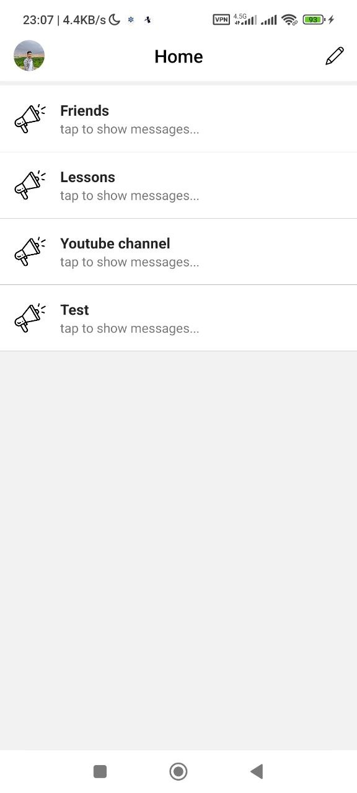

<h1 align="center">
 🔥 Simple realtime chat app (React Native using expo) 🔥
</h1>
<h3 align="center">
  You can signup and login and create room for sending and receiving message to and from others or friends.
</h3>
<h2 align="center">
  💢 using vpn 💢
</h2>
<hr />
<div style="display:flex; align-items: center; justify-content:space-between" align="center">
  
  
  
  
</div>

# Installation

```
git clone https://github.com/DtechB/chat-app.git
cd chat-app
```

```
yarn install
```

```
yarn start
```
### and then run on your phone or emulator

<hr />

## Packages and technologies that used in project:
<a href="https://developer.mozilla.org/en-US/docs/Web/JavaScript" title="JavaScript"></a>
<a href="https://reactjs.org/" title="React"></a>
<a href="https://www.npmjs.com/" title="npm"></a>
<a href="https://yarnpkg.com/" title="Yarn"></a>
<a href="https://www.firebase.com/" title="Firebase"></a>

## Install Demo android app

[DEMO](https://expo.dev/accounts/dtechb/projects/chat-app/builds/61a4089d-8940-4bd4-99bb-b00134627d58)

